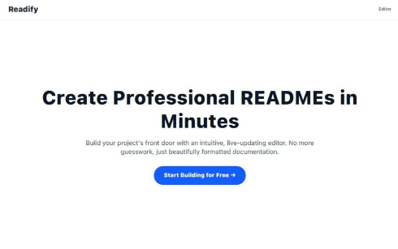
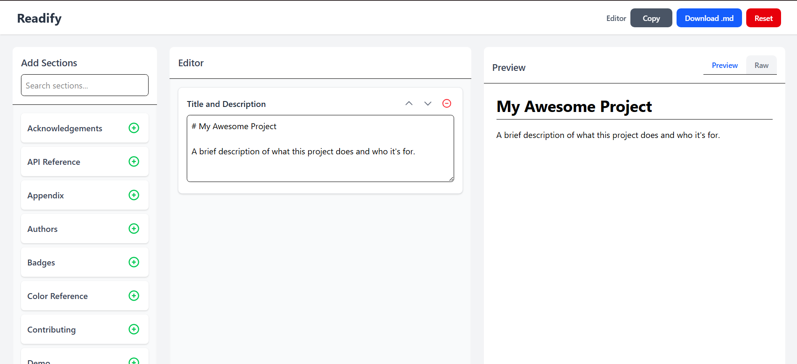

# Vite + React Project

A simple React application bootstrapped with [Vite](https://vitejs.dev/), fast and optimized for modern web development.  
This project is deployed on [Vercel](https://vercel.com) and configured for smooth SPA routing.

## 🚀 Features

- ⚡ **Vite** for lightning-fast builds and hot-reload.
- ⚛ **React 18** with functional components.
- 🎨 Supports CSS imports and static assets.
- 🌐 Ready for **Vercel deployment**.
- 🔄 SPA routing support (no 404 on refresh).

## 🌐 Live Demo
🔗 **[View Website]([[https://<your-vercel-project-name>.vercel.app](https://readme-generator-hlwlj917h-upas-projects-7f75dec8.vercel.app/editor)](https://readme-generator-hlwlj917h-upas-projects-7f75dec8.vercel.app/editor))**


## 📸 Screenshot




## 🛠 Installation

```bash
# Clone the repository
git clone https://github.com/<your-username>/<your-repo>.git
cd <your-repo>

# Install dependencies
npm install
```
